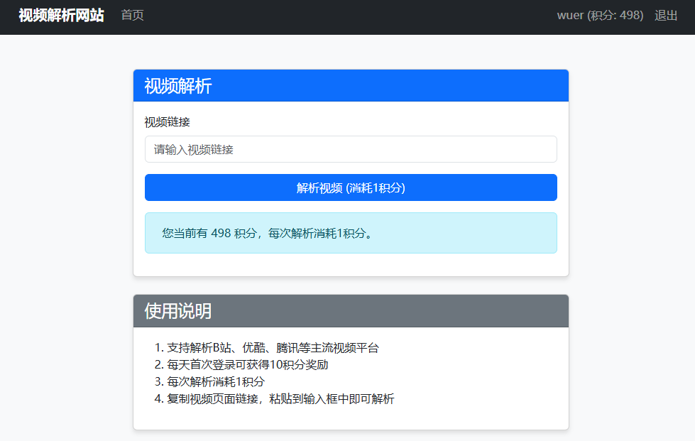
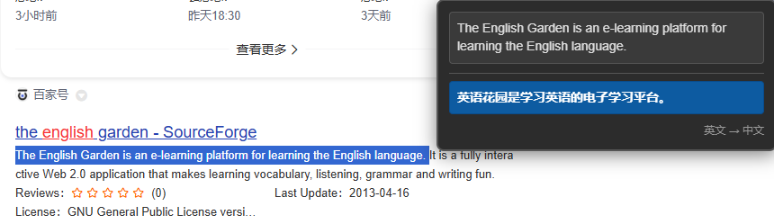

### 联系方式

- 公众号/视频号:勿二的AI智库
- 邮箱：tyrant961119@gmail.com
- 微信:

### 作品

- 小程序-相守晴雨表，帮助用户了解婚姻关系的优势和可能需要改进的地方

  

- web应用（git仓库地址：https://github.com/wuer-ai/web_application）

  - 视频解析网站-解析b站、抖音网站视频，并下载
  - 

- chrome小插件（git仓库地址：https://github.com/wuer-ai/plug-in）

  - chrome浏览器页签自动分组
  - 

  - kimi右侧边栏
  - 

  - 中英文翻译插件
  - 
  - 

- 持续更新

### 关于我

勿二 | AI 头部社群行动家

数字游民  · AI编程革命推动者

现任大厂产品经理 | 转型“一人产品”中

### 座右铭

流水不争先，争滔滔不绝